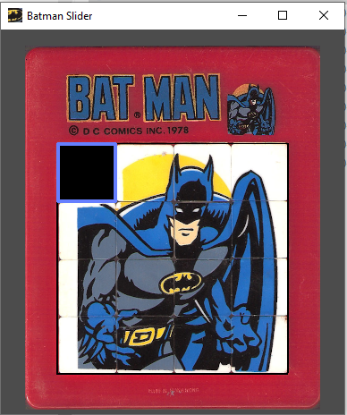

# Batman Slider

This is a beginner project using Godot. 

This is a recreation of a favorite childhood toy - slide the tiles to scramble or form the picture. 
Controls - asdw, up,down,left,right, touch or click tile next to empty spot.

## Play the game

[Play on the web](https://dirtslayer.github.io/Batman-Slider/exports/Batman%20Slider.html)

[Download Windows EXE](./exports/Batman%20Slider.exe)
[Download Resources for EXE as PCK](./exports/Batman%20Slider.pck)

[Download Android APK](./exports/Batman%20Slider.apk)

## Get the Project Files

[Github repo](https://github.com/dirtslayer/Batman-Slider)

## Support Developers Continued Learning

<iframe frameborder="0" src="https://itch.io/embed/650970" width="552" height="167"><a href="https://dirtslayer.itch.io/batman-slider">Batman Slider by Darrell</a></iframe>
